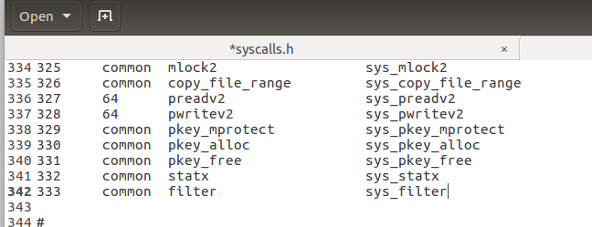
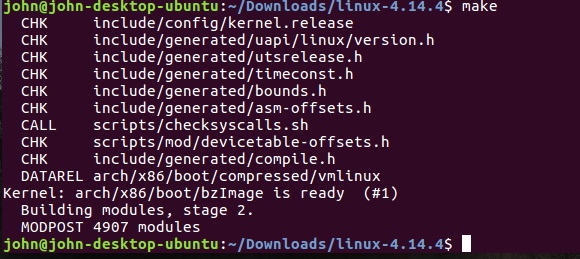
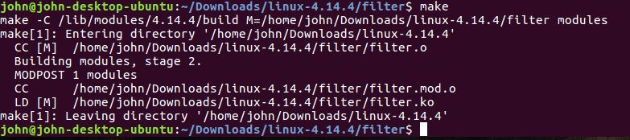
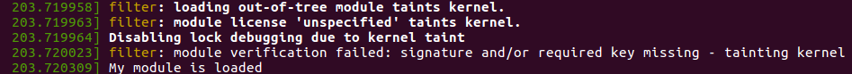
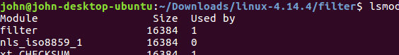

Kernel Filter
=============

## John Harvey

### About
The goal: write and insert into kernel code that filters a file. The filter will change 'e' to 'E' on read-only. Example: The extra excess becomes ThE Extra ExcEss. The code will run in kernel space, using 2 different methods: either via **changing code and recompiling your custom kernel** or a **loadable kernel module**.  

First, i visisted kernel.org and downloaded the latest stable kernel which was 4.14.4. After that i made sure i had the required packages installed before i got started. I then configured which modules were included by running make menuconfig.  

Once everything was ready, i ran make inside the root kernel directory and waited about an hour for it to compile fully. To test it out, i ran make modules_install and make install to install this newly compiled kernel on my machine. After updating the grub i was able to successfully boot into the new kernel.  

Next step was to implement a custom read function in kernel space. I tried two different approaches. One was reading a file from kernel space using a loadable module, and the other implementing a custom system call in the kernel.  

### Install Notes - Loadable Kernel Module
1. Clone repo with git `git clone https://github.com/jharvey7136/kernel_filter.git`
2. Navigate to the app's filter directory through terminal
3. Run with command `make`

#### Method 1

**Implementing a custom system call:**  
I made a directory in the linux-4.14.4 directory, and created a c file. The c file contained:  
```c
asmlinkage long sys_filter_e(void) {
//code
}
```

the make file was:
`obj-y:=filter.o`  

After those steps i had to modify the necessary kernel files to integrate the system call. I went to the kernels makefile and modified this line, adding filter/ to the end:  

`core -y  += kernel/ mm/ fs/ ipc/ security/ crypto/ block/ filter/`  

Then I had to alter the syscall_64.tbl file and included the new system call number and entry point. The next system call available was 333.
And lastly, i had to alter the syscalls.h file, adding the header of my system call to it:  

`asmlinkage long sys_filter_e(void);`

After recompiling with:  
`sudo make -j 4 && sudo make modules_install -j 4 && sudo make install -j 4`  

I was able to test out the new system call with a simple test.c

#### Method 2

**Loadable Kernel Module**

In the 'filter' directory, i created a filter.c and a Makefile. This approach wasnt necessarily a new custom system call, but rather doing the read function in kernel space. Doing this i had to use `get_fs` and `set_fs`, `filp_open`, and the read by calling `file->f_op->read(file, buf, 128, &f->f_pos);` in the init_module.  


However, i did have some errors with this method. I was able to compile it with no errors. But when i did insmod, it return 'killed' so i must have done something wrong in the init_module. 


### Overall: 

I was able to compile the kernel successfully, and also add a custom system call to do a read in kernel space. Changing the 'e' to 'E' was simple.  

After filling the buf with read, changing the char's was basically: the ascii code for 'e' is 101, the ascii for 'E' is 69
```c
bytes = sizeof(buf);
      for (t = 0; t < bytes; i++){
        if (buf[i] == 101){
          buf[i] = 69;
        }
      }
```

### Screenshots
**Custom system call added - line 342, number 333**  


**Compiled kernel**  


**Loadable module compiled**  


**Module loaded**  


**Filter module loaded**  


### Resources
[https://www.howtoforge.com/reading-files-from-the-linux-kernel-space-module-driver-fedora-14#reading-files-from-the-linux-kernel-space-moduledriver-fedora-]  
[https://tnichols.org/2015/10/19/Hooking-the-Linux-System-Call-Table/]  
[http://ytliu.info/notes/linux/file_ops_in_kernel.html]  
[https://medium.com/@ssreehari/implementing-a-system-call-in-linux-kernel-4-7-1-6f98250a8c38]  
[https://medium.freecodecamp.org/building-and-installing-the-latest-linux-kernel-from-source-6d8df5345980]


